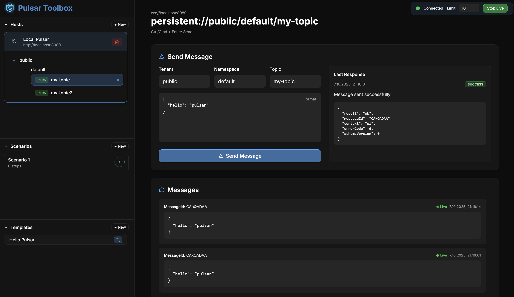

# <span style="display:inline-flex;align-items:center;"> Pulsar Toolbox</span>

Pulsar Toolbox is a desktop-friendly dashboard for exploring and testing Apache Pulsar clusters. The app focuses on day-to-day tasks such as connecting to multiple brokers, crafting reusable payloads, replaying traffic, and monitoring live topics without leaving a single workflow. It is built with Next.js and packaged with Tauri and Rust so it can run as a lightweight native application.



## Why this project exists

Working with Pulsar typically requires juggling command-line tools or writing throwaway scripts. Pulsar Toolbox aims to provide an approachable alternative for:

- **Rapid message iteration** – send, clone, and tweak payloads against a Pulsar topic in seconds.
- **Operational validation** – peek backlog messages, tail live traffic, and inspect acknowledgements while debugging producers or consumers.
- **Scenario automation** – describe multi-step test flows (for example, warm-up messages followed by bursts) and run them repeatedly as part of QA or demos.
- **Saved Tools** – save hosts, templates, and scenarios locally so you can reuse consistent configuration when testing against shared clusters.

## Feature overview

- **Host manager** – store any number of Pulsar endpoints, organized into navigable topic trees.
- **Topic browser** – quickly switch tenants, namespaces, and topics while keeping the current context visible.
- **Message templates** – maintain reusable payloads which can be send with drag and drop onto a topic.
- **Manual send & peek** – send messages with acknowledgement feedback, peek historical messages with custom limits, and timeouts.
- **Live tail** – stream messages from an active topic with adjustable history size and connection status indicators.
- **Scenario runner** – define, reorder, and execute scripted sequences of sends or waits with live progress reporting. Even on multiple hosts, tenants, namespaces and topics (changeable per message).

## Tech stack

- [Next.js 15](https://nextjs.org/) with the App Router
- [React 19](https://react.dev/)
- [Tailwind CSS 4](https://tailwindcss.com/) for styling
- [Tauri 2](https://tauri.app/) for native packaging
- OS keyring storage via [`tauri-plugin-keyring`](https://github.com/tauri-apps/tauri-plugin-keyring)
- TypeScript throughout the codebase

## Getting started

### Prerequisites

- Node.js 20+
- npm 10+ (or another package manager compatible with the included `package-lock.json`)
- Tauri platform-specific prerequisites: see https://v2.tauri.app/start/prerequisites/
- Protobuf compiler (`protoc`) 3.21+ available on your `PATH` for the Rust-side Pulsar client helpers
- A running Apache Pulsar instance. For local development you can start standalone brokers with Docker:

  ```bash
  docker run -d --name pulsar -p 6650:6650 -p 8080:8080 apachepulsar/pulsar:latest bin/pulsar standalone
  ```

### Install dependencies

```bash
npm install
```

### Launch the Tauri desktop shell (development)

```bash
npm run tauri:dev
```

This command opens the Pulsar Toolbox UI in a native window powered by Tauri. Use this when testing desktop-specific functionality.

### Build for production

- **Desktop bundle**

  ```bash
  npm run tauri:build
  ```

The Tauri build pipeline produces platform-specific artifacts in `src-tauri/target`.

## Using the dashboard

1. **Add a host** – use the sidebar action to register the Pulsar endpoints you want to work with. If an Admin Endpoint is configured the toolbox automatically discovers tenants, namespaces, and topics for quick navigation.
2. **Select a topic** – choose a topic to open message sending, live tailing, and reader controls in the main panel.
3. **Send messages** – fill in tenant, namespace, topic, and payload fields (or pick an existing template) and submit to send a message. Acknowledgement details appear immediately.
4. **Peek or tail** – specify limits, and timeouts to fetch historical messages or enable the live panel to stream new ones.
5. **Create scenarios** – orchestrate multi-step message flows, save them, and re-run as needed for regression or demo purposes.

Configuration is persisted locally, making it simple to switch between clusters or resume previous testing sessions.

### Connecting to secured Pulsar clusters

When adding a host you can paste endpoints that already contain SSL schemes. For example:

- Service URL: `pulsar+ssl://cluster.example.com:6651`
- Admin base: `https://cluster.example.com:8443`

Service URLs that use the `pulsar://`, `pulsar+plain://`, or `pulsar+ssl://` schemes default to the native broker ports (6650 for plaintext, 6651 for TLS) when no port is specified. Provide an explicit port if your cluster uses non-standard mappings. The Tauri desktop shell connects through the Rust `pulsar` crate, so producers and readers always speak the binary protocol on those endpoints with full TLS and token support.

- Desktop builds suppress the verbose `pulsar` crate connection logs by default so repeated history reads don’t spam the terminal. Set `RUST_LOG=pulsar=info` before launching if you need to inspect those connection details.

For secured clusters, you can configure access tokens. A host can either use a combined token (the same token for both its admin and service endpoints), or separate tokens for the admin endpoints and the service endpoints.

If your Pulsar admin endpoint is signed by a self-hosted or private certificate authority, paste the PEM-encoded CA bundle into the **Custom CA certificate** field when adding the host. Pulsar Toolbox injects that bundle into HTTPS discovery requests so it can verify the server certificate without disabling TLS validation. The same trust material is shared with the native Pulsar client used by the Rust backend, so private roots work end-to-end without disabling certificate checks.

### Token storage

Tokens and other Pulsar credentials are stored exclusively in the operating system keyring via `tauri-plugin-keyring`. The app never writes these values to localStorage or IndexedDB. When you remove a host, its associated tokens are also deleted from the keyring so secrets do not linger after cleanup.

## Contributing

Contributions are welcome! If you plan to add a feature or fix a bug:

1. Fork the repository and create a feature branch.
2. Install dependencies and run the development server or Tauri shell.
3. Add or update tests when appropriate.
4. Submit a pull request describing your changes and include screenshots or recordings for UI updates.

## License

This project is released under the [MIT License](./LICENSE). Feel free to adapt and share it in your own tooling or workflow.
